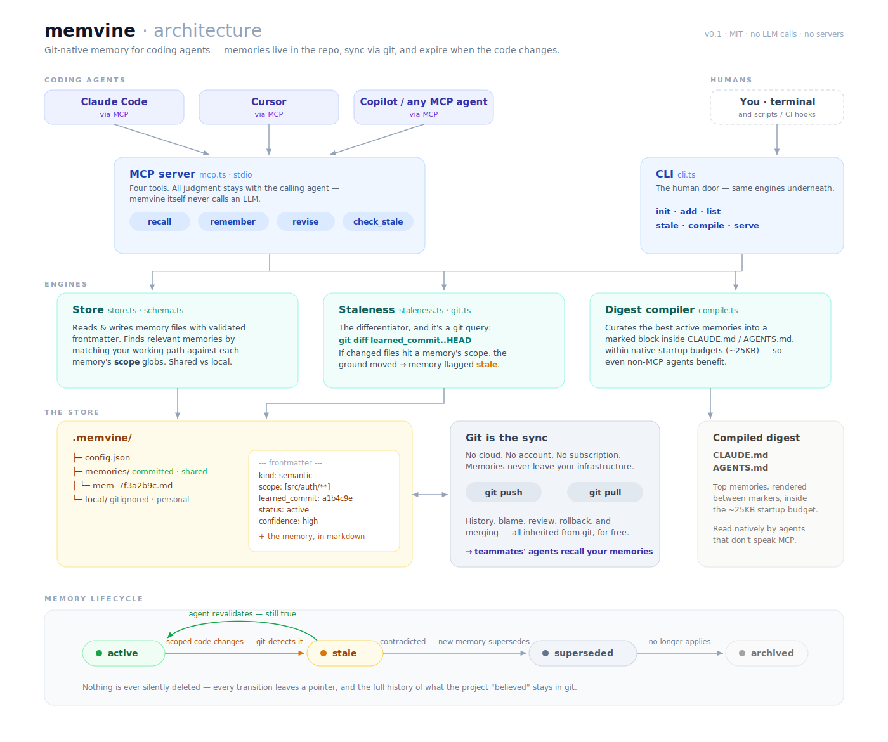

# memvine

Git-native memory for coding agents. What your agent learns lives in your
repo, travels with the clone, and expires when the code changes.

## Why

Coding agents forget. Claude Code's auto memory stays on one machine and
loads only the first 200 lines of its index at session start. Windsurf keeps
memories per-workspace and its own docs tell you not to rely on them. The
hosted memory layers sync your team's knowledge through a vendor's cloud, on
a subscription.

memvine stores each memory as a markdown file in `.memvine/`, inside the
repo. `git push` shares it with your team. `git clone` onboards a new
machine. Every memory records the commit it was learned at, so when the code
it describes changes, memvine flags the memory stale and your agent
re-checks it instead of repeating something that stopped being true three
merges ago.

There is no database, no embedding index, no daemon, no account, and no API
key. Retrieval works on plain files. On [LongMemEval-V2](https://arxiv.org/html/2605.12493v1),
file-based memory beat vector RAG by about 30 points.

## Architecture



## Quickstart

```bash
npm install -g memvine
cd your-repo
memvine init
```

Add it to your agent. For Claude Code:

```bash
claude mcp add memvine -- npx memvine serve
```

Your agent gets four tools: `recall` fetches relevant memories at task
start, `remember` stores knowledge after checking for contradictions,
`revise` updates or retires a memory after re-checking it, and
`check_stale` flags memories whose code has changed.

## What a memory looks like

```markdown
---
id: mem_7f3a2b9c
kind: semantic
tags: [test, auth]
scope: [src/auth/**]
learned_at: 2026-07-22T21:14:00Z
learned_commit: a1b4c9e
agent: claude-code
status: active
confidence: high
---
The auth integration tests require the local vault container to be started
first (`make vault-dev`), otherwise they fail with connection refused —
this is NOT a flaky test.
```

Commit it and every teammate's agent knows it too. Refactor `src/auth/`
and memvine marks it stale for re-checking.

## Memory types

The four kinds copy how cognitive science divides human long-term memory,
because each type needs a different lifecycle:

| Kind | Stores | Example | Staleness |
|---|---|---|---|
| `episodic` | what happened | "Tried Node 22 in March, broke the linter, rolled back" | Never. History stays true. |
| `semantic` | what is true | "Auth uses magic links, chosen over passwords" | Stales when its code changes |
| `procedural` | how to do something | "To deploy: make stage, wait for green, promote" | Stales when its code changes |
| `prospective` | what to do later | "When billing v2 ships, delete the LAUNCH_FLAG hack" | Archived once fulfilled |

An agent picks the kind by asking what sentence it is storing. What
happened is episodic. What's true is semantic. How to is procedural. Do
later is prospective. Domain labels like `test` or `auth` go in freeform
`tags`.

The distinction earns its keep in the staleness engine: refactor
`src/auth/` and the semantic memory "login uses magic links" gets flagged
for re-checking, while the episodic memory "we tried passwordless in March
and support tickets spiked" stays untouched, because history remains true
no matter what the code does now.

## CLI

| Command | Does |
|---|---|
| `memvine init` | Create the `.memvine/` store |
| `memvine add "..." -k semantic -t test auth -s "src/auth/**"` | Add a memory by hand |
| `memvine list` | List memories (`--all` includes retired ones) |
| `memvine stale` | Report memories whose scoped files changed (`--mark` to flag them) |
| `memvine compile` | Render top memories into CLAUDE.md / AGENTS.md |
| `memvine serve` | Run the MCP server |

## Design decisions

**memvine never calls an LLM.** Dedup, contradiction checks, and
re-validation run in the calling agent, steered by the MCP tool
descriptions. The agent that is already running pays for its own thinking.
memvine's code is git commands and file operations.

**Staleness is a git query.** `git diff learned_commit..HEAD` against each
memory's scope, cheap enough to run at every session start.

**Shared and local are separate.** `.memvine/memories/` is committed and
reviewed in PRs like the code it describes. `.memvine/local/` is gitignored
for machine-personal notes. Store no secrets in either; memories are plain
text in your repo.

## Status

v0.1. The memory schema may change before 1.0. Issues and PRs welcome, see
[CONTRIBUTING.md](CONTRIBUTING.md).

## License

[MIT](LICENSE)
